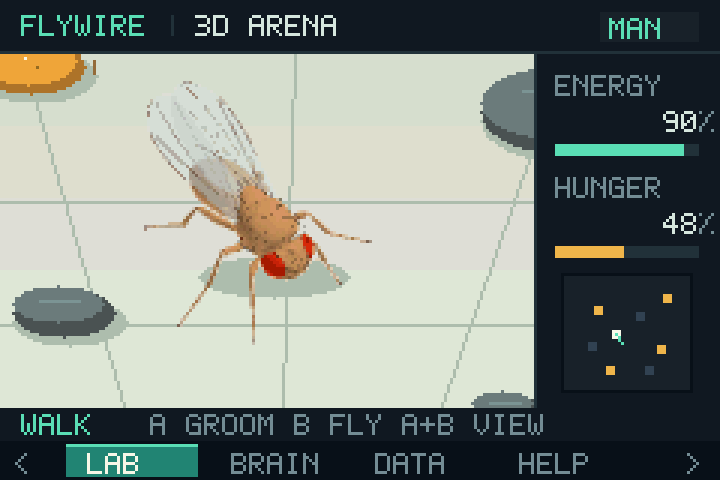
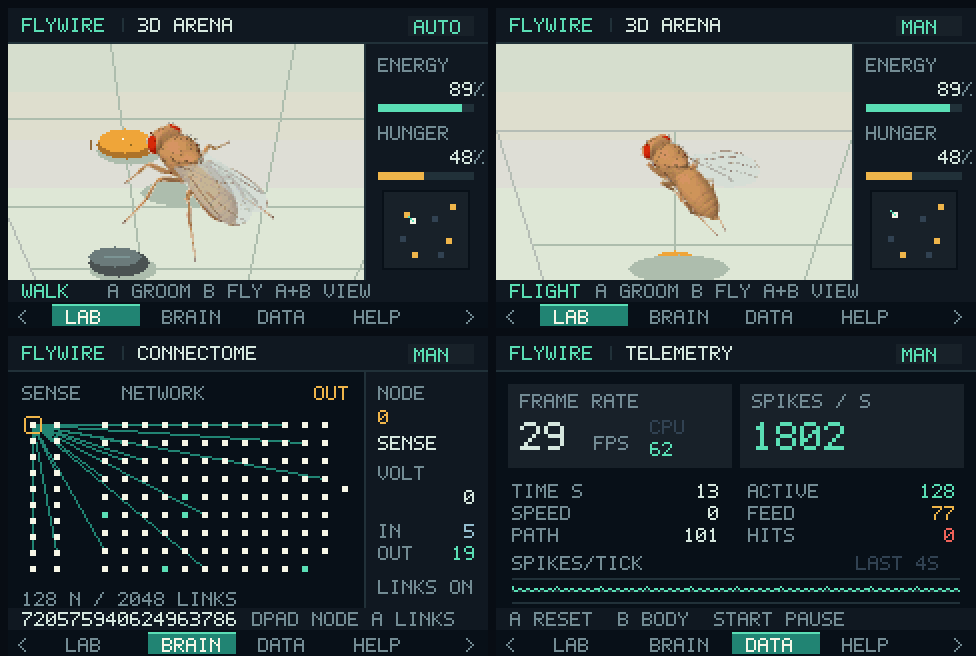

# FlyWireGBA

[](https://github.com/LakoMoor/FlyWireGBA/actions/workflows/ci.yml)
[](https://github.com/LakoMoor/FlyWireGBA/releases/latest)

A **Game Boy Advance ROM** featuring an articulated fruit fly, a small real FlyWire connectome, and live neural and behavioral telemetry.

**[Download the `.gba` from GitHub Releases](https://github.com/LakoMoor/FlyWireGBA/releases/latest)** and open it in [mGBA](https://mgba.io/) or load it on a compatible GBA flash cartridge. A local build produces `dist/fly.gba`.





## Features

- An anatomical **flybody** model developed by Google DeepMind and HHMI Janelia: connected head and thorax, compound eyes, segmented abdomen, antennae, six articulated legs, wings with veins, and a proboscis.
- Offline rendering of the articulated 3D model into transparent, shaded sprites. The GBA selects the appropriate direction and animation frame; the arena uses software perspective projection. This keeps the model detailed without running MuJoCo or a large mesh renderer on the handheld.
- Idle, alternating tripod walk, flight with folded legs and moving wings, feeding, head grooming, and rest. Takeoff and landing follow the simulation's changing height.
- Autonomous sugar seeking, obstacle avoidance, hunger and energy, plus manual movement and turning.
- Standard, close, and overhead views; an arena minimap; separate energy and hunger indicators.
- A real reduced **FlyWire FAFB v783** network: **128 neurons and 2,048 directed signed edges**, including 20 surviving sugar sensory IDs and one MN9 from the lists published by Shiu et al.
- A neural activity map with spike flashes, selected-neuron connections, incoming/outgoing counts, root ID, and model voltage.
- Measured FPS and CPU utilization, simulated time, speed, distance, spikes per second, recently active neurons, contact, feeding and collision counters, spike history, and time spent in each behavior.
- Pause and session reset. A hardware timer advances simulation at 30 ticks per second independently of display refresh.

## Controls

| GBA button | Action |
|---|---|
| L / R | Cycle arena, neural map, telemetry, and help |
| Select | Toggle autonomous / manual control |
| Up / Down | Move forward / backward in manual arena mode |
| Left / Right | Turn in manual arena mode |
| Hold B | Fly; release to land |
| Hold A | Groom |
| Press A+B together | Standard → close → overhead view |
| Start | Pause / resume |
| D-pad on neural map | Select a neuron |
| A on neural map | Show / hide connections |
| B on telemetry page | General / body and behavior metrics |
| A on telemetry page | Reset the session |

Press Select first for full manual control. In AUTO mode, the simulation continues on the other pages. Ground contact with sugar stimulates the sensory neurons; MN9 spikes gate food intake. Movement, energy, voltage, and distance use demonstration units.

## Scientific scope

**The anatomical edges and root IDs come from real FlyWire data.** The ROM contains a small extracted subgraph, not the complete fly brain. The neural map is a schematic layout without anatomical soma coordinates.

The 2,048 strongest internal connections among the selected 128 nodes are retained. Published signs are preserved; aggregated weights are quantized. The integer LIF demonstration uses 33.3 ms steps, threshold 100, leakage of 1/8, and a one-tick refractory period. It does **not** reproduce the calibrated temporal parameters of the Shiu model.

Body shape and joint attachments derive from [flybody](https://github.com/TuragaLab/flybody). Meshes are simplified and shaded offline; the gait, wing cycle, grooming, and feeding poses are illustrative animations. The ROM does not include flybody's physics, learned controllers, or biomechanical validation. Wing animation depicts flight and does not reproduce the fly's biological wingbeat frequency.

A compact heuristic controller handles locomotion, flight, grooming, and energy. The extracted neural circuit controls the feeding gate through MN9. The ROM identifies these limitations in its help page.

The GBA has 256 KiB EWRAM and 32 KiB IWRAM. Sprite data stays in cartridge ROM; a small subgraph fits in memory in place of the full connectome. See the [GBA memory map](https://mgba-emu.github.io/gbatek/#gba-memory-map).

## Build and test

```sh
make             # ARM-capable Clang, LLD, llvm-objcopy, and Python 3
make test        # Native ASan/UBSan, behavior, provenance, sprites, and ROM header
make preview     # Host-rendered PPM frames using the same renderer
```

On Ubuntu, install `clang lld llvm`. `tools/build.py` searches PATH and Homebrew's LLVM directory; it can also use LLD bundled with Rust. Override paths with `CLANG`, `LD_LLD`, and `LLVM_OBJCOPY`. The ROM build needs neither devkitARM nor MuJoCo, Python scientific packages, or downloaded models: generated assets are committed.

The ROM, ELF, and link map are written to `build/`; a ROM copy is written to `dist/`. `make clean` removes `build/`.

The real cartridge test uses the **mGBA 0.10.5 core** and reads emulated RAM and framebuffers:

```sh
python3 tools/run_emulator_check.py --source /path/mgba --build /path/mgba-build
python3 tools/export_media.py  # Pillow; uses actual emulator captures
```

It covers boot, movement, flight/landing, grooming, feeding, all three views, neural and telemetry pages, and pause. See [validation](docs/validation.md) for results and limits. Physical GBA hardware has not been tested.

## Regenerate assets

Connectome extraction needs NumPy, PyArrow, `Connectivity_783.parquet`, and `figures.ipynb` from the [authors' repository](https://github.com/philshiu/Drosophila_brain_model):

```sh
python3 tools/import_connectome.py /path/Connectivity_783.parquet /path/figures.ipynb
make
```

Selection uses three-step forward/backward anatomical relevance between sugar receptors and MN9, followed by induced-subgraph extraction and absolute-weight ranking. Quantization is `sign(w) * round(sqrt(abs(w)) * 7)`, clamped to ±96. Original weights and IDs are in [connectome_edges.csv](docs/connectome_edges.csv); source hashes and extraction settings are in [connectome.json](docs/connectome.json). One of the 21 sugar IDs and the second MN9 were absent from this v783 table and were excluded.

Optional body asset authoring instructions and exhaustive pose checks are described in [body-model.md](docs/body-model.md). The pinned source, original joint anchors, reduced mesh, and generation scripts are included for reproducibility.

## CI/CD and releases

Every branch push and pull request builds the ROM, runs native ASan/UBSan checks, validates data and cartridge assets, and runs the actual cartridge in mGBA. Tested ROMs, release archives, checksums, and screenshots are uploaded as workflow artifacts.

A `vX.Y.Z` tag triggers the release workflow. After validation, it publishes a `.gba`, a ZIP containing documentation and licenses, `SHA256SUMS`, and a manifest. The tag must match `VERSION`. Tags ending in `-alpha.N`, `-beta.N`, or `-rc.N` publish prereleases. Publishing uses the repository's standard `GITHUB_TOKEN`.

```sh
make all test
python3 tools/package_release.py --tag v0.1.0
```

See [CONTRIBUTING.md](CONTRIBUTING.md) for the release procedure. Actions and downloaded test sources are pinned by SHA/hash.

## Sources and licenses

- [FlyWire](https://flywire.ai/), [data guidelines](https://flywire.ai/guidelines), and [connectome publication](https://doi.org/10.1038/s41586-024-07558-y).
- [Shiu et al., 2024: A Drosophila computational brain model reveals sensorimotor processing](https://doi.org/10.1038/s41586-024-07763-9) and [published data and neuron lists](https://github.com/philshiu/Drosophila_brain_model).
- [flybody](https://github.com/TuragaLab/flybody), Google DeepMind / HHMI Janelia; anatomical model and derivative body assets under Apache-2.0.
- [mGBA](https://github.com/mgba-emu/mgba) and [devkitPro gbafix](https://github.com/devkitPro/gba-tools/blob/master/src/gbafix.c) for the cartridge header specification.

Original project code is MIT. FlyWire-derived data is **CC BY-NC 4.0**; its attribution and noncommercial conditions also apply to the included derivative data in the ROM. The flybody-derived graphics retain **Apache-2.0** terms. See [LICENSE](LICENSE), [THIRD_PARTY_NOTICES.md](THIRD_PARTY_NOTICES.md), and [bundled third-party licenses](licenses/). This project is not an official FlyWire or flybody product.
